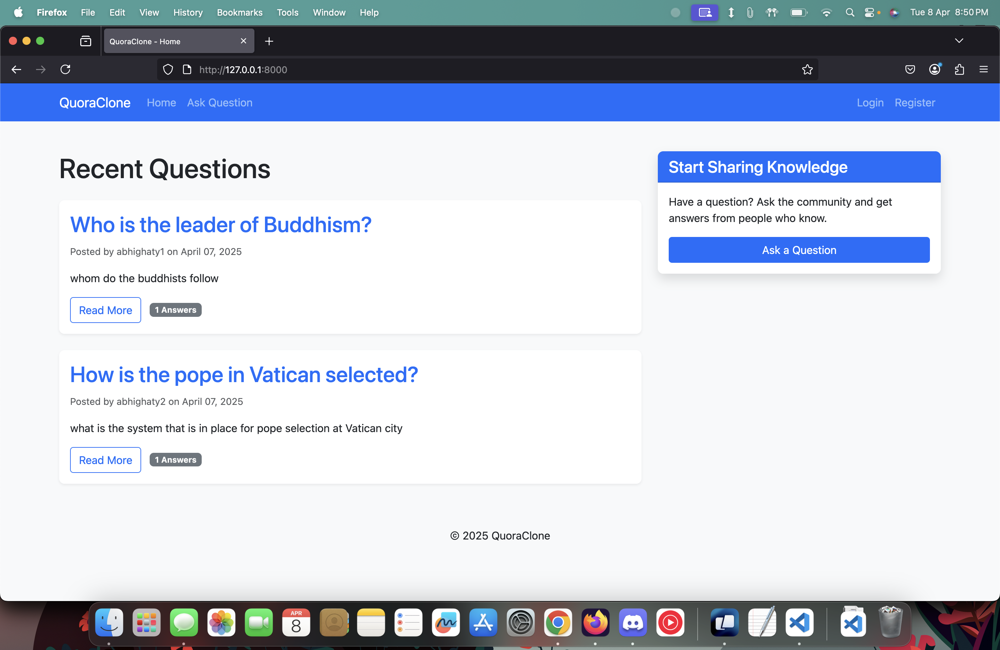
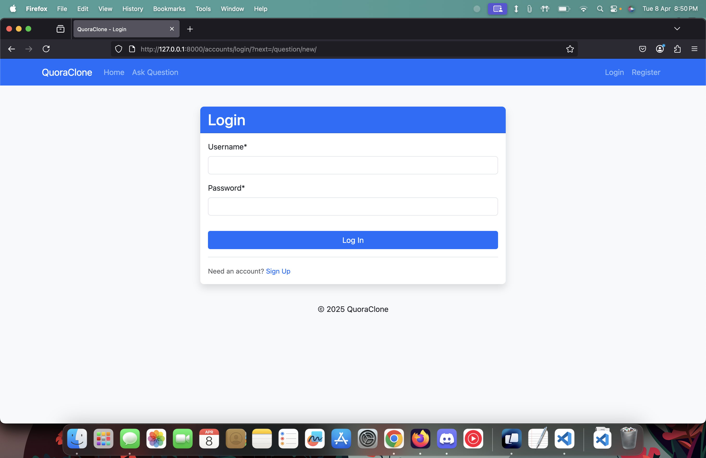
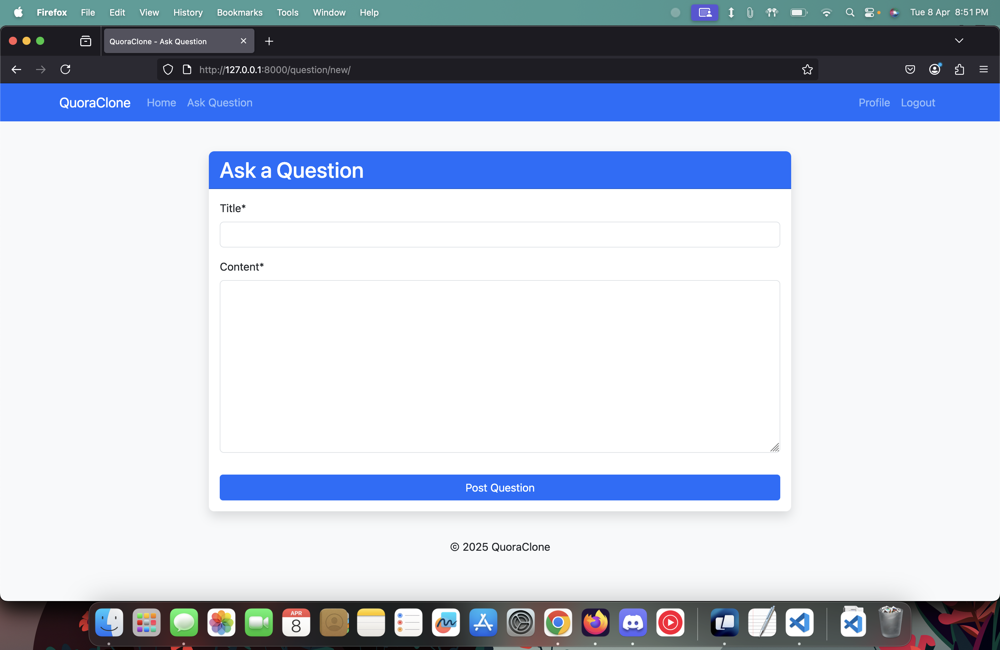
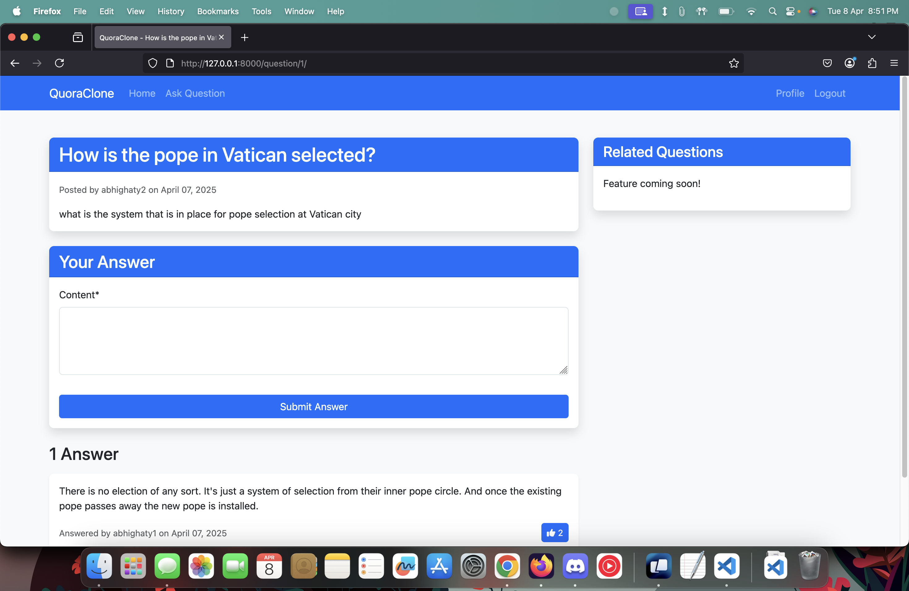
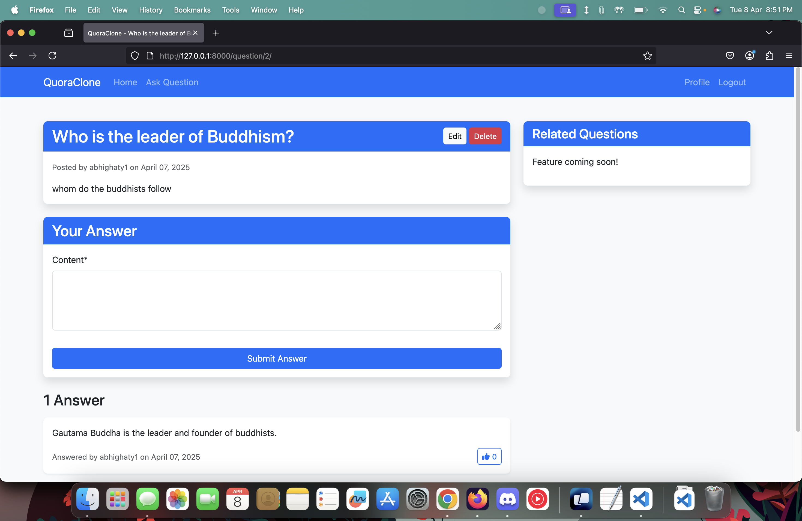

# Quora Clone

A Django-based Q&A platform inspired by Quora with user authentication, question posting, and answer functionality.

## Features
- User registration and authentication
- Post questions and answers
- Like answers
- User profiles

## Setup Instructions

1. **Clone the repository**
   ```bash
   git clone https://github.com/abhighaty/quora_clone.git
   cd quora-clone
2. **Create and activate a virtual environment**
   
* On Windows:
```
python -m venv venv
```
```
venv\Scripts\activate
```
* On MacOS/Linux:
```
python -m venv venv
```
```
source venv/bin/activate
```
3. **Install dependencies**
```
pip install -r requirements.txt
```
4. **Apply database migrations**
```
python manage.py migrate
```
5. **Create a superuser (optional)**
```
python manage.py createsuperuser
```
6. **Run the development server**
```
python manage.py runserver
```

7. **Access the application**
   * Open your browser and go to http://127.0.0.1:8000/
   * Admin interface is available at http://127.0.0.1:8000/admin/

## Screenshots
  
### Home Page


### Question Page

### Answer Page

### Question Page

### Answer Page


